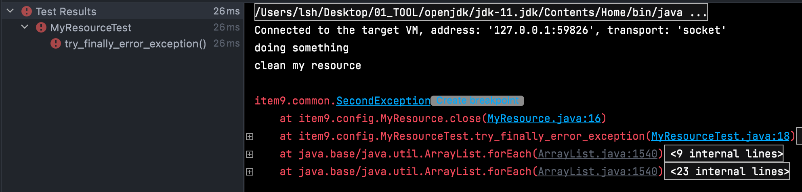
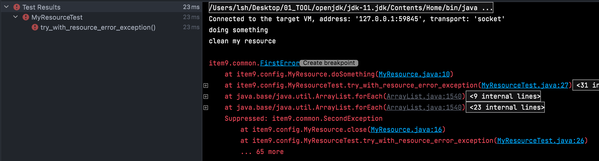

# [아이템9] try-finally 보다는 try-with-resources

이 내용은 `이펙티브 자바 Effective Java 3/E` 를 읽으면서 정리한 내용을 포함하고 있습니다

자바 라이브러리에는 close 메소드를 호출해 직접 닫아줘야 하는 자원들이 있습니다.

InputStream, OutputStream, Connection 등이 좋은 예입니다. 이러한 자원 닫기는 놓치기 쉬워서 예측할 수 없는 성능 문제로 이어지기도 합니다. 이러한 자원 중 상당수가 안전망으로 finalizer를 활용하고 있지만 그것은 믿을만 하지 못합니다.

전통적으로는 자원이 제대로 닫힘을 보장하는 방법으로 `try-finally` 를 사용하였습니다.

```java
static String firstLineOfFile(String path) throws IOException { 
	BufferedReader br = new BufferedReader(new FileReader(path));
  try {
    return br.readLine();
  } finally {
    br.close();
  }
}
```

여기서 자원을 하나 더 사용한다면 어떻게 될까요?

```java
static void copy(String src, String dst) throws IOException {
  InputStream in = new FileInputStream(src);
  try {
    OutputStream out = new FileOutputStream(dst);
      try {
        byte[] buf = new byte[BUFFER_SIZE];
        int n;
        while (n = in.read(buf) >= 0) {
          out.write(buf, 0, n);
        }
  		} finally {
    		br.close();
  		}
  	} finally {
    	in.close();
  }
}
```


## try-finally 

예를 들어, 기기에 물리적인 문제가 생겨서 `firstLineOfFile` 메서드 안의 readLine 메서드가 예외를 던지고, 같은 이유로 close 메서드도 실패하게 됩니다. 

이러한 상황에서는 두 번째 예외가 첫 번째 예외를 완전히 집어삼겨 버리게 됩니다. 이렇게 되면 디버깅이 어렵게 됩니다.

이러한 문제는 `try-with-resources` 로 해결되었습니다.


## try-with-resources

이 구조를 사용하기 위해서는 해당 자원이 AutoCloseable 인터페이스를 구현해야 합니다. 단순히 void를 반환하는 close 메서드 하나만 덩그러니 정의한  인터페이스입니다. 닫아야 하는 자원을 뜻하는 클래스를 작성한다면 AutoCloseable를 반드시 구현해야 합니다.

```java
static String firstLineOfFile(String path) throws IOException { 
  try (BufferedReader br = new BufferedReader(new FileReader(path)) {
    return br.readLine();
  }
}
```

자원을 하나 더 사용한 경우의 예시입니다.

```java
static void copy(String src, String dst) throws IOException {
  try (InputStream in = new FileInputStream(src);
      OutputStream out = new FileOutputStream(dst)){
    	byte[] buf = new byte[BUFFER_SIZE];
      int n;
      while (n = in.read(buf) >= 0) {
      	out.write(buf, 0, n);
      }
  	}
  }
}
```

`try-with-resources` 버전이 짧고 읽기 수월할 뿐 아니라 문제를 진단하기도 훨씬 좋습니다. 

firstLineOfFile 메서드를 생각해보면, readLine과 close 호출 양쪽에서 예외가 발생하면, close에서 발생한 예외는 숨겨지고 readLine에서 발생한 예외가 기록됩니다. 

개발자에게 보여줄 예외 하나만 보존되고 여러 개의 다른 예외가 숨겨질 수 있습니다. 이렇게 숨겨진 예외들도 그냥 버려지지는 않고, 스택 추적 내역에 숨겨졌다는 꼬리표를 달고 출력됩니다. 

자바 7에서는 Throwable에 추가된 getSuppressed 메서드를 이용하면 프로그램 코드에서 가져올 수 있습니다.


`try-with-resources` 에서도 catch 절을 사용할 수 있습니다. catch 절 덕분에 try 문을 더 중첩하지 않고도 다수의 예외를 처리할 수 있습니다. 아래는 예외를 던지는 대신 기본값을 반환하도록 하였습니다.

```java
static String firstLineOfFile(String path, String defaultVal) { 
  try (BufferedReader br = new BufferedReader(new FileReader(path)) {
    return br.readLine();
  } catch (IOException e) {
    return defaultVal;
  }
}
```


## 실습

첫번째 에러를 정의하였습니다.

```java
public class FirstError extends RuntimeException {
}
```

두번째 에러를 정의하였습니다.

```java
public class SecondException extends RuntimeException {
}
```

첫번째, 두번째 에러가 나타나는 resource를 생성하였습니다.

```java
public class MyResource implements AutoCloseable {

    public void doSomething() throws FirstError {
        System.out.println("doing something");
        throw new FirstError();
    }

    @Override
    public void close() throws SecondException {
        System.out.println("clean my resource");
        throw new SecondException();
    }
}
```


try-finally 부터 테스트를 진행해보도록 하겠습니다.


### try-finally 테스트

```java
@Test
void try_finally_error_exception() {
  
	MyResource myResource = null;
	try {
		myResource = new MyResource();
		myResource.doSomething();
	} finally {
		if (myResource != null) {
			myResource.close();
		}
	}
}
```

실행해보면 다음과 같습니다.



- `FirstError` 의 대한 내용이 없는 것을 확인할 수 있습니다.
- 두 번째 예외인 `SecondException` 이 첫 번째 예외인 `FirstError` 를 완전히 집어삼겨 버리게 됩니다. 이렇게 되면 디버깅이 어렵게 됩니다.


이제, try-with-resource 테스트를 진행해보도록 하겠습니다.


### try-with-resource

```java
@Test
void try_with_resource_error_exception() {

	try (MyResource myResource = new MyResource()) {
		myResource.doSomething();
	}
}
```

실행해보면 다음과 같습니다.



- 첫 번째 예외 `FirstError` 와 두 번째 예외 `SecondException` 모두 로그에 나타난 것을 확인할 수 있습니다.


## 정리

- 꼭 회수해야 하는 자원을 다룰 때는 try-finally 말고, try-with-resources 를 사용해야 합니다.
  - 코드는 더 짧고 분명해지고, 만들어지는 예외 정보도 훨씬 유용합니다.
- try-finally로 작성하면 실용적이지 못할 만큼 코드가 지저분해지는 경우가 있으나, try-with-resources로는 정확하고 쉽게 자원을 회수할 수 있습니다.


## 참고

- [이펙티브자바 #9 Try-with-Resource](https://www.youtube.com/watch?v=zqjZBSqHs0s&list=PLfI752FpVCS8e5ACdi5dpwLdlVkn0QgJJ&index=9)