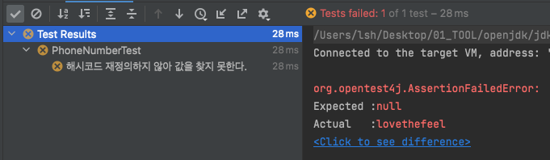
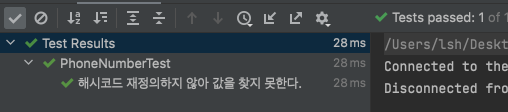
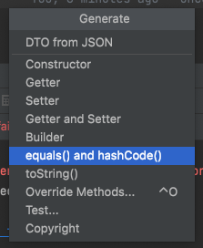

# [아이템11] equals를 재정의하려거든 hashCode도 재정의하라

이 내용은 `이펙티브 자바 Effective Java 3/E` 를 읽으면서 정리한 내용을 포함하고 있습니다.

`equals` 를 재정의한 클래스 모두에서 `hashCode` 도 재정의해야 합니다. 그렇지 않게 되면 `hashCode` 일반 규약을 어기게 되어 해당 클래스의 인스턴스를 HashMap 이나 HashSet 같은 컬렉션의 원소로 사용할 때 문제를 일으키게 됩니다.


## Object 명세

- equals 비교에 사용되는 정보가 변경되지 않았다면, 애플리케이션이 실행되는 동안 그 객체의 hashCode 메서드는 몇 번을 호출해도 일관되게 항상 같은 값을 반환해야 합니다. 단, 애플리케이션을 다시 실행한다면 이 값이 달라져도 상관없습니다.
- equals(Object)가 두 객체를 같다고 판단했다면, 두 객체의 hashCode는 똑같은 값을 반환해야 합니다.
- equals(Object)가 두 객체를 다르다고 판단했더라도, 두 객체의 hashCode가 서로 다른 값을 반환할 필요는 없습니다. 단, 다른 객체에 대해서는 다른 값을 반환해야 해시테이블의 성능이 좋아집니다.


hashCode 재정의을 잘못했을 때 크게 문제가 되는 조항은 두번째입니다. 즉, 논리적으로 같은 객체는 같은 해시코드를 반환해야 합니다.

다음은 핸드폰번호의 대한 객체입니다.

```java
public class PhoneNumber {

    private int phone1;
    private int phone2;
    private int phone3;

    private PhoneNumber(int phone1, int phone2, int phone3) {
        this.phone1 = phone1;
        this.phone2 = phone2;
        this.phone3 = phone3;
    }

    public static PhoneNumber of(int phone1, int phone2, int phone3) {

        return new PhoneNumber(phone1, phone2, phone3);
    }
}
```

객체를 생성하여서 map에 저장하고 map에서 저장된 객체를 조회하는 테스트를 작성하였습니다.

```java
@DisplayName("해시코드 재정의하지 않아 값을 찾지 못한다.")
@Test
void findByNull() {

	Map<PhoneNumber, String> phone = new HashMap<>();
  phone.put(PhoneNumber.of(707, 867, 5309), "lovethefeel");

  assertEquals(phone.get(PhoneNumber.of(707, 867, 5309)), "lovethefeel");
}
```

위 테스트는 성공할까요? *실패하게 됩니다.*



논리적 동치인 두 객체가 서로 다른 해시코드를 반환하여 null을 반환하게 됩니다. 

그 결과 get 메서드는 엉뚱한 곳에서 객체를 찾으려 한 것입니다. 이러한 문제는 PhoneNumber 에 적절한 hashCode 메서드만 작성해주면 해결이 됩니다. 

```java
public class PhoneNumber {
  
  	...
      
    @Override
    public boolean equals(Object o) {
        if (this == o) return true;
        if (o == null || getClass() != o.getClass()) return false;
        PhoneNumber that = (PhoneNumber) o;
        return phone1 == that.phone1 && phone2 == that.phone2 && phone3 == that.phone3;
    }

    @Override
    public int hashCode() {
        return Objects.hash(phone1, phone2, phone3);
    }
}
```

그럼, 다시 한번 테스트를 실행해보도록 하겠습니다.




그렇다면, 올바른 hashCode 메서드는 어떤 모습이여야 할까요?


## hashCode 작성하는 법

좋은 해시 함수라면 서로 다른 인스턴스에 다른 해시코드를 반환합니다. 좋은 hashCode 작성하는 요령은 생략하겠습니다. 

hashCode는 `Lombok` 과 같은 플러그인을 통해서도 생성 가능하고, IDE에서도 지원을 합니다. Intellij에서는 다음과 같이 생성할 수 있습니다.

- 작성한 클래스에서 단축키(맥 OS : `Command + N`, 윈도우 : `alt + Insert`) 를 이용하여서 생성할 수 있습니다.

  


재정의 진행시, 성능을 높인답시고 해시코드를 계산할 때 핵심 필드를 생략해서는 안 됩니다.

hashCode가 반환하는 값의 생성 규칙을 API 사용자에게 자세히 공표하지 말아야 합니다. 그래야 클라이언트가 이 값에 의지하지 않게 되고, 추후에 계산 방식을 바꿀 수도 있습니다.


## 정리

- equals를 재정의할 때는 hashCode도 반드시 재정의해야 합니다.
  - 그렇지 않으면 프로그램이 제대로 동작하지 않을것입니다.
  - 다행히도 우리가 사용하는 `Lombok` 과 IDE에서 생성하는 equals와 hashCode는 같이 재정의하게끔 되어 있습니다.