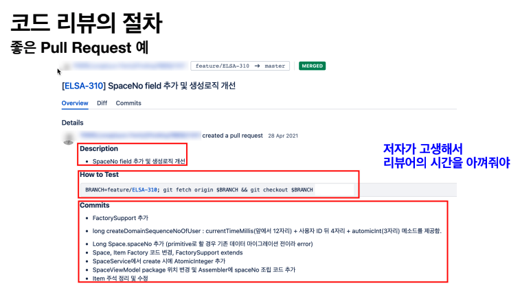
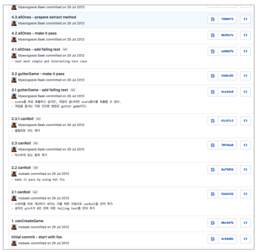

# 지속가능한 SW 개발을 위한 코드리뷰

해당 내용은 아래 유튜브 영상을 토대로 내용을 정리한 것입니다.
- [영상 바로가기](https://youtu.be/ssDMIcPBqUE)


## 목차

- 왜 코드 리뷰를 해야 하나 ?
  - 우리가 살고 있는 시대
  - 개발생산성 / SW 공학의 특성 / 장인정신
  - 코드 리뷰의 정의 / 목적
- 코드 리뷰의 절차
- 왜 코드 리뷰가 어려운가
- 기법들
  - 효율적인 PR 방법
  - 효율적인 리뷰 방법
  - 피드백 방법
  - 교착상태 시
  - 추가적인 사례
  - 코드 리뷰를 하는 아주 재밌는 방법


## 왜 코드 리뷰를 해야 하나 ?

### 우리가 살고 있는 시대

- 소프트웨어에 의해 운영되는 제품과 서비스들의 영역이 늘어나고 있음
- `변동성의 시대` : 급격한 사회 발전으로 인한 불확실하고, 복잡하고, 모호하며 변화가 많은 세상이 될것
- Global GDP에서 Tech의 비율이 2020년 5% -> 2030년 10% 증가하였는데, 주목할 만한 것은 나머지가 90%로 DT(Digital Transformation)는 이제 시작임
- (Build 2021) 지난 2년동안 Non-Tech 영역에서 개발자 수 증가속도가 Tech 영역에서보다 가파름
- 비즈니스 성공을 위한 개발의 역할 및 개발 조직의 성능(생산성)이 중요해짐


### SW 공학의 특성

- SW 공학의 설계와 빌드
  - 설계 : 완전한 소스 코드
  - 빌드 : 컴파일
- 좋은 설계 ~= 클린코드
- 설계를 잘하는 사람 ~= 코드를 잘 작성하는 사람
- SW의 진정한 비용은 유지보수로, 한번 작성된 코드는 10번 이상 읽으며 작성 보다 이해에 10배의 노력을 소요
- 90% 이상의 시간을 어떤 코드를 이해하는데 사용합니다.
- 높은 품질의 제품은 비싸다.
- `The only way to go fast, is to go well - Robert C. Martin`


### SW 장인정신

- 지식과 경험의 공유 만이 전문성을 갖춘 개발자 육성
- 코드 리뷰는 개발자가 지금부터 당장 행할 수 있는 공유 활동 ex) `Code SNS 댓글 놀이`
- 배움을 주고 받으며 지속가능한 SW 개발자가 될 수 있는 실천법
- `Code review is a software quality assurance activity in which one or several people check a program mainly by viewing and reading parts of its source code, and they do so after implementation or as an interruption of implementation.`


### 목적

- 주목적 : 품질 문제 검수(버그, 장애)
- 더 나은 코드 품질 : 아키텍처 속성 개선을 위한 코드 개선(향후 변경 비용 개선)
- 학습 및 지식 전달 : 코드, 해결책 등과 관련된 지식 공유에 기여
  - 공유(주고 받는 학습)를 통한 역량 증대 및 성장
    - 대개의 경우 리뷰어들도 리뷰 과정에서 지식을 얻게 됨(하드스킬, 소프트스킬)
  - 동기부여
- 상호 책임감 증대
  - 집단 코드 오너십 및 결속 증대
  - 내가 하고 있는 일에 관심을 가져주는 것
  - 팀에서 일어나는 일 공유. 내 동료는 무엇을 하나 ? 팀웍
- 설계 개선 제안
- 개발 문화 개선


### 정의

- 위키피디아 내용
```
코드 검토(code review)는 코드를 개발자가 작성하고, 다른 개발자가 정해진 방법을 통해 검토하는 일을 말한다. 등위 검사, 제3자 검사라고도 한다. 검토는 페어 프로그래밍(동료 프로그래밍), 비공식 워크스루(informal walkthroughs), 공식 소프트웨어 검사와 같은 다양한 형태로 수행된다.
```


## 코드 리뷰의 절차

- 저자(Author)
  - 코드 작성, 리뷰 요청
- 리뷰어
  - 코드를 읽고
  - 머지 가능한지 결정
- 변경 내역(Change List, PR)
  - 리뷰 시작 전에 작성
  - 저자가 머지를 원하는 소스 코드에 대한 일련의 변경(잘한 것, 아쉬운 것, 눈여겨 볼 것)에 대해 기술


### 좋은 Pull Request 예

- 저자가 고생해서 리뷰어의 시간을 아껴줘야 한다.
  - 저자가 고생하면 코드 리뷰 하는 시간을 많이 절약할 수 있다.
- 모든 산출물(생산물)은 소비자를 위한 것이다. 코드 리뷰는 리뷰어를 위해서 작성하는 것이 중요하다.




## 왜 코드 리뷰가 어려운가?

- 저자
  - 본인 생각에 멋지다고 생각하는 PR을 보냄
- 리뷰어
  - 왜 멋지지 않은지에 대한 장황한 이유를 작성

`In aviation, for example, people who greatly overestimate their level of skills are all dead.`

- 코드에 대한 비판을 자신에 대한 비판으로 이해
- 코드 리뷰는
  - 지식 / 공학적 결정을 공유하는 기회
  - `공유`(잘 한 것, 아쉬운 것)를 통해 서로의 지식/경험을 나누며 상호 학습을 통한 역량 증대 수단
  - 코드 토의를 `개인적 공격`으로 받아들이면 물거품
    - 리뷰를 올리지 않거나
    - 코드를 감추려고 하거나
- 생각을 `글로 전달하는 것에 대한 어려움`
  - 오해의 위험이 큼(음성 톤, 표정의 부재)
- 피드백을 조심스럽게 표현하는 것이 더 중요
  - `You forgot to close the file handle` -> 표현한 내용을
  - `I can't believe you forgot to close the file handle! You're such an idiot` -> 다르게 받아들임


## 기법들

- 효율적인 PR 방법


### 효율적인 PR 방법

- 지루한 작업은 컴퓨터로 처리
- 스타일 가이드를 통해 스타일 논쟁을 해소
- PR을 올릴 때 주석 달기
- (리뷰어) 모두를 포함하라
- 의미있는 커밋으로 분리


#### 지루한 작업은 컴퓨터로 처리

- 코드를 읽는 것은 인지적 부담이되는 고수준의 집중이 요구되는 작업
  - 컴퓨터가 할 수 있는 일에 이런 노력을 낭비하지 말라
  - 심지어 기계가 더 잘 할 수 있는 일에 -> `정적 분석은 기계가 더 잘 함`
- Formatting Tool
  - 공백, 들여쓰기 오류 등
  - 별도의 커밋/PR로 분리. 리뷰 불필요를 기술해서 리뷰를 생략할 수 있도록
- unused import, declaration과 같은
  - error로 처리해서 더 빨리 인지할 수 있도록 하는 방법
  - intellij -> Preferences -> inspections > Imports > Unused import > Severity > Error로 변경


#### 스타일 가이드를 통해 스타일 논쟁을 해소

- 좋은 스타일 가이드를 사용
- 조직에서 스타일 가이드를 점진적으로 만들어가면서 사용
- 위 2개를 합쳐서 적절히 사용


#### PR을 올릴 때 주석 달기

- PR은 저자가 먼저 읽어 보고 -> 리뷰어들을 위한 설명을 커멘트로 남겨서 -> 리뷰어들의 시간을 절약할 수 있게 하라


#### 리뷰어에 모두를 포함하라

- 많은 사람이 보면 버그를 더 잘 찾아낼 수 있다.
- 많은 사람이 본다는 것을 알면 사람들은 대개 더 잘하려고는 경향이 있다.


#### 의미있는 커밋으로 분리

##### 혼자하는 코드 리뷰



한번에 해도 되지만 잘게 나눠놓았다. 그렇게 하면 보는 사람이 편해지고 그 보는 사람 중에 내가 될 수도 있다.


### 효율적인 리뷰 방법

- 리뷰는 즉시 시작
- 고수준으로 시작, 저수준으로 내려가라
- 예제 코드 제공에 관대하라
- 리뷰의 범위를 존중하라
- 태그를 활용
- 한 두 등급만 코드 레벨을 올리는 것을 목표


#### 리뷰는 즉시 시작

- 코드 리뷰를 높은 우선순위로
  - 저자는 리뷰 종료될 때까지 대기(Blocked)함
- 리뷰를 바로 시작하면 선순환됨
  - 코드를 읽고 피드백을 줄 때는 시간을 가지고 진행해도 되지만 시작은 바로 해라
  - 이상적으로는 수분 내에
- 리뷰 라운드의 최대 시간은 하루
  - 우선순위 높은 업무로 1일 내 불가하면 다른 리뷰어 지정
  - 월 1회 이상 재지정을 해야한다면 속도를 줄여서 건강한 개발 관습(Practices)을 유지할 수 있어야함
- 처음 리뷰할때는 굉장히 어렵기 때문에 더 자주해야 한다.
  - 리뷰 시간을 확보, 예를 들어 매일 아침 30분, 점심 식사 후 30분을 리뷰를 위해 미리 확보  
- 근본적인 문제는 사람들이 리뷰할 시간이 없다고 느낀다는 것임
  - 당신의 개인 기여로만 평가를 받고 있다면, 팀을 돕기 위해 수행하는 모든 일은 시간 낭비처럼 보임
  - 이것은 리뷰를 하는 것의 문제라기보다는 조직적인 문제임


#### 고수준으로 시작, 저수준으로 내려가라

- 리뷰 라운드에서 `많은 의견을 남길 수록, 저자가 당황`할 위험 커짐
- 하나의 라운드에 20~50개 정도의 의견은 위험의 시작
- 초기 라운드에서는 `고수준 피드백으로 제한`
  - 버그, 장애, 성능, 보안 등
  - Extract Method, Composed Method, Invert-if(복잡도) 등
- 고수준의 피드백이 처리된 후에 `저수준 이슈`를 처리
  - (선택적인) 설계 개선
  - 변수명 변경, 주석을 명확하게 하는 것 등


#### 예제 코드 제공에 관대해라

- 저자를 기분 좋게 하기 위한 방법
  - 리뷰 중에 선물 주기(코드 예제)
- 너무 긴 예제는 관대한 것이 아니라 억압적으로 보임
  - 라운드당 2~3개의 코드 예제로 제한
  - 모든 PR에 예제를 제공하면 저자가 코드를 작성할 수 없다고 생각한다는 신호


#### 리뷰의 범위를 존중하라

- 자주 보이는 Anti-Pattern
  - PR 근처의 코드를 보고 저자에게 수정을 요청한다.
- Rule of thumb
  - PR에 포함되지 않은 라인은 리뷰 범위가 아님
  - 단, 예외적으로 PR이 둘러싼 코드에 영향을 미칠 때는 리뷰 필요


#### 한두 등급만 코드 레벨을 올리는 것을 목표로

- D 등급의 PR을 받으면 저자가 C나 B 등급을 받도록 도와라
  - Letter Grade
- 완전하지는 않아도 충분히 좋은 코드가 되도록
- F 등급
  - 기능적으로 틀렸거나
  - 너무 복잡해서 정합성에 확신이 없는 상태
- 승인을 보류하는 유일한 이유
  - 수 차례의 리뷰 라운드 후에도 코드가 F 상태인 경우


### 피드백 방법

- 절대 `너` 고 하지 마라(너는 왜 맨날 ...)
- 건설적인 피드백을 하라
- 진정한 칭찬을 해라
- 피드백은 명령이 아니라 요청으로 표현해라
- 의견이 아니라 원칙에 기반하여 피드백하라
- 반복적인 패턴에 대해서 피드백을 제한하라


#### 절대 `너` 라고 하지 마라(너는 왜 맨날 ...)

- 리뷰의 핵심
  - “무엇이 코드를 나아지게 하는가”
  - “누가 그런 아이디어(잘못)를 냈는지”가 아님
- 저자의 방어 유발을 최소화하는 방법으로 피드백
  - 비판의 대상은 코드. 저자가 아님
  - `너` : 저자의 주의를 코드에서 자신으로 바꿈
- `너` 만 빼라(저자에 대한 판단 → 단순한 정정)
  - `You misspelled suc'cessfully` → `sucessfully → successfully`
  - I Message 대화법: 행동 - 결과 - 감정
- ~하는 것을 제안합니다. ~하는게 어떨까요 ? ←오픈커뮤니케이션
  - 물어보면 대답함. 안한다고 대답해도 되고


#### 건설적인 피드백을 하라

- 동료들 간의 코드 리뷰
  - 경쟁 유발(X)
  - 팀의 생산성을 높이는 것(O)
- 코드 리뷰를 자신의 코드에 대해 비판이 아니라 학습의 과정으로 인지하면 전체적인 프로
젝트의 성공에 기여함
- 건설적인 피드백은 개발자들이 그들의 실수에서 배우고 역량을 증대하도록 동기부여함
- 건설적인 피드백을 못하겠으면 차라리...(하지 않는 것이)


#### 진정한 칭찬을 해라

- 대부분의 리뷰어가 잘못된 부분에만 집중
  - 하지만 리뷰는 긍정적 행위 강화를 위한 값진 기회이기도 함
- PR에서 좋은 변경이 있을 때마다
  - “오 이런 API가 있나요. 정말 유용해요”
  - “정말 좋은 해결책이네요. 생각도 못 했네요”
  - “함수를 분리한 것은 좋은 생각이에요.훨씬 단순해졌어요”
- 저자가 주니어 혹은 신규 입사자라면 리뷰에 매우 민감하고 방어적일 수 있음
- 진심어린 칭찬은 리뷰어가 잔인한 감시자가 아니라 도와주려는 팀동료라는 것을 보여서 이
런 긴장감을 낮춤


#### 피드백은 명령이 아니라 요청으로 표현해라

- 일상에서 동료에게 명령하지 않음
  - 명령형(How): “12번 테이블 자리가 비어있습니다. 우리 가족은 저 자리로 걸어가 앉을 것입니다.”
  - 요청(What): “네 명 앉을 자리를 부탁해요” ← 선언형. Tell, Don’t Ask
- 하지만 리뷰에서는 강압적인 명령이 종종 발견됨
  - ex. 이 클래스를 별도의 파일로 분리하라
  - → 이 클래스를 별도의 파일로 분리할 수 있을까요 ?
    or 이 클래스는 너무 커지는 것 같은데 괜찮을까요 ? ← 나의 걱정


#### 의견이 아니라 원칙에 기반하여 피드백하라

- 저자에게 의견을 줄 때는
  - “제안하는 변경”과 “변경의 이유”를 모두 설명하라
  - ex. 이 클래스를 2개로 분리해야 해요
    → 지금 이 클래스는 파일 다운로드와 파싱의 2가지 책임을 가지고 있어요.
    다운로더와 파서 2개의 클래스로 분리하여 SRP를 준수하는 것이 어떨까요 ?
- SW는 과학인 동시에 예술 ???
  - 항상 원칙에 기반하여 정확히 뭐가 잘못 되었는지 언급할 수 있는 것은 아니다
  - 단지 그냥 보기 싫거나 직관적이지 않을 수 있다
  - 무엇을 할 수 있을지 객관적으로 설명하라
  - ex. 이 코드는 혼란스럽네요(너?) → 나는 이 코드를 이해하기 어렵네요 (I Message)


#### 반복적인 패턴에 대해서 피드백을 제한하라

- 저자의 실수가 동일한 패턴임을 식별 했다면 모든 경우를 언급하지는 말라
- 동일 패턴에 대해서 2~3개 정도의 예를 언급하라
- 그 이상은 저자에게 개별 사례가 아니라 패턴에 대해서 수정을 요구하라


### 교착상태 시

- 교착상태를 적극적으로 처리해라


#### 교착상태를 적극적으로 처리해라

- 교착상태로 향하는지 나타내는 표식
  - 토론의 톤이 점차 팽팽해지고 공격적으로 됨
  - 라운드당 커멘트가 줄어들지 않는 경향을 보임
  - 너무 많은 커멘트에 저항이 보임
- 코드 리뷰의 최악의 결과는 교착상태(Stalemate)
  - 커멘트를 반영하지 않으니 승인 거부
  - 저자는 커멘트 반영을 거부
- 만나서 얘기하라
  - 화상 혹은 만나서 논의(특히 복잡한 리뷰)
  - 텍스트 기반 의사소통은 상대가 인간이라는 것을 잊게 함
- 인정하거나 Escalate하라
  - 교착상태가 길어지면 관계가 나빠짐(퇴사)
  - 그냥 승인하는 비용(Agree to disagree - 갈등 해결책)
  - 저수준 코드를 무심코 승인하면 SW 품질이 낮아질 수 있음
  - 동료와 너무 다퉈서 함께 일하지 않게 된다면 고수준의 품질을 얻을 기회가 사라짐
- 인정이 불가한 경우
  - 저자에게 논의를 팀장이나 테크 리더에게 Escalation
  - 다른 리뷰어에게 할당
- 교착상태로 부터 회복
  - 상황을 관리자와 논의하라
  - 휴식을 가져라. 가능하다면 안정될 때까지 PR을 서로 보내지 마라
  - 갈등 해결책을 학습하라
- 설계 리뷰를 고려하라
  - 코드 리뷰 때 설계 리뷰 때 논의되었어야 할 사항을 논쟁하는가?
  - 설계 리뷰는 있었나 ?
- 아주 심각하지 않다면
  - 그냥 인정하고 좋은 관계로 동료와의 협업을 지속해라
  - Agree to disagree


### 코드 리뷰를 하는 아주 재밌는 방법

- PR을 작성한 사람과 짝 프로그래밍을 하며 어떻게 고치는 게 좋은지 보여주고
- Revert
- PR을 작성한 사람이 스스로 개선할 수 있도록 기회를 주는 ....
  - 20분 짝 프로그래밍 개선 / 2시간 스스로 개선
  - “그래야 스스로 하는 법을 배움”
- 결정은 저자가
  - "완벽한 설계"가 아니라 "당신이 할 수 있는 최고의 설계”를 추구 - Letter Grade
  - 팀 정신을 유지하기 위해 불완전한 해결책을 받아들여라
  - 모든 설계 결함이 항상 실제로 문제가 되지는 않음
- "코드 리뷰의 목적은 비난이 아니라 배움이다"(https://bit.ly/3ohzTa8)
  - 종종 리뷰어들도 배우게 됨
- 리뷰하려는 코드가 그냥 나쁠 때가 있음
  - 저자가 그날 무슨 일이 있을 수도
  - "XXX님. 이 코드 샘플을 당신의 이력서에 추가해야 할까요 ?”
- 신규 입사자, 경험이 부족한 팀원의 코드를 리뷰하면서 이런 상황을 만났다면 좀 더 안내하는 가르침으로 전환하라


### 코드 리뷰 문화 정착의 어려움 / 극복방법

- 저자의 노력
  - 리뷰어 n 명의 시간을 절약
  - 효과적인 리뷰 가능
- 리더의 관심과 의지
  - 가끔, 그러나 매우 자세히
- 코드 비난에 대한 두려움
- 멋져 보여야
  - 하고 싶어짐. 그게 뭐든(Tool, IDE, Hotkey)
  - 따라 하고 싶어져야
- How do you inspire your team to adopt that mentality(craftmanship. TDD, Pair Programming)
  - 좌절할 준비를 하라
  - 당신이 원한다고 남에게 영감을 줄 수는 없다
  - 당신은 당신 자신의 태도만 제어 가능. 타인이 나의 태도에 어떻게 반응할 지는 제어 불가
  - 영감은 부산물(side effect)
    - 내가 어떻게 하면 모범이 될 수 있을까 ?
    - 특정 행동이나 특정 기술을 채택하도록 하려면 모범이 되어야 함
    - 기술을 마스터 해야 함
- 그러니 모범이 돼라
  - 지각하지 말라. 업무에 기여하라. 긍정적으로 임해라. 사람들을 잘 대하라
  - 기술적 훈련(Technical Discipline)에 대해 언급하려면 고도로 숙달되어야 함
  - 키보드로 코딩을 할 때 사람들이 경악을 하도록 해라
- 이렇게 당신이 엄청난 모습을 보여주면 아마도 몇몇 사람들에게는 영감을 줄 수도 있을 것이다


### 코드 리뷰 효과

- 예상하지 못한 버그를 타 프로젝트에서 발견하기도
- 시간이 지나니 선플이 달리기 시작
  - “코드가 깔끔하네요"
  - “이렇게 구현하는 수도 있군요. 좋네요”
- 많은 사람이 내가 작성한 코드를 본다는 생각에 PR 전에 한번 더 코드를 다듬게 됨
- 좋은 설계, 아키텍처, 클린코드, TDD 등에 대한 공감대/열정 형성
  - 잘하는 동료를 보면 잘하려는 열정이 생김


### 코드리뷰를 잘 하기 위해 필요한 기술들

#### 리팩터링

- 결과의 변경 없이 코드의 구조를 재조정함
  - 주로 가독성을 높이고 유지보수를 편하게
  - 버그를 없애거나 새로운 기능을 추가하는 행위는 아님
- Refactoring
  - 리팩터링의 효과
  - 다양한 리팩터링 기법
- TDD와 연결된 리팩터링
  - 돌아가는 코드를 가지고 설계를 하는 행위
  - 그린필드 프로젝트에서 아무것도 없는 상태에서 분석/설계부터 시작하는 비율
- 코드리뷰에서 많이 언급하는 기술적 내용
- 매일 리팩터링
  - Continuous Renaming
  - Composed Method(Extract Method)
  - 응집도 높이기
  - Discover Value Object


#### Legacy Code 다루기

- 의존성 관리: Subclass & Override Method
- 테스트 추가: Characterization Test
- 새로운 코드 빠르게 추가 : Sprout/Wrap Method/Class
- 레거시 분석


#### Clean Code & TDD

- TDD
  - 전통파(Classic) and(not vs) 런던파(London)
  - Outside in → Inside out(https://bit.ly/3F5GDxa)
- Clean Code
  - https://cleancoders.com/
  - https://bit.ly/3f64aTU


## Q&A

- 코드리뷰 자체가 중요할까 ?
  - 공유와 코드에 대한 논의를 할 수 있는 문화가 중요
- 개발 생산성 vs 개발 품질의 트레이드오프
  - 버그 수정 비용은 개발 라이프싸이클(개발, 테스트(로컬, 통합, 스테이지), 배포 등)후반으로 갈수록
  기하급수적으로 커짐
  - 품질이 높으면 라이프싸이클의 후반으로 갈 수록 시간이 절약됨
  - 따라서 TDD, Test, Refactoring, Code Review 등은 생산성을 증대시킴
  - 거기다 높은 품질은 “향후 추가 비용”을 감소시킴
- 확인
  - 자신들의 상태를 공유하고 피드백을 받아봐야 가능. 찾아가라
- 너무 기법/절차에 의지하지 말라
  - 온오프를 적절히 섞어라. SKP 병풍
  - 툴(bitbucket, github, upsource, ...) ? 일단 사람의 눈에 잘 읽히는 코드인지가 중요
- 좋은 줄은 아는데...일정, 우선 순위1
  - 우리는 시간이 정해진 시험에서 성적을 평가는 받는 것임2
  - 시간을 아끼는 가장 좋은 방법 = 저자의 노력
- 주기: 짧게 자주. 그러니 PR 사이즈 작게
- 꾸준히 코드리뷰를 진행하나 그럼에도 불구하고 조기에 발견될 수 있는 오류가 추후에 장
  애로 발견되는 사례가 아직도 빈번히 발생. 어떤 부분을 놓치고 있는건지, 리뷰 문화를 정
  착할때 가장 중요시 되는 철학은 무엇이 있을까요?
  - 리뷰를 한다고 100% 버그를 사전에 잡을 수는 없음. 수학이 아니라 과학임
  - 누적되면 조직의 버그 사전 탐지율이 높아질 것
- 상사를 어떻게 설득하나 ?
  - 측정 항목을 정해서 개선 효과를 측정하라
    - 변경 실패율(change failure rate): 결함이 발생하는 빈도를 측정
    - 장애 복구 시간(failure recovery time): SW가 정상적으로 동작하지 않는 시간
    - 빈도(frequency): 상용 환경에 변경 사항을 출시하는 빈도
    - 리드 타임(lead time): “아이디어 ~ 출시 가능한 SW”까지의 시간
  - 의사결정권자들에게 중요한 것 이해 & 신뢰 구축
  - 작은 단위로 올바른 방향으로 나갈 수 있는 기회 찾기
    - 테스트 커버리지 → 품질/효율성 개선(비즈니스 지표)
  - 허가가 필요한가 ?
    - 자동화 테스트 작성, 리팩터링, 코드리뷰, 짝프로그래밍 등
