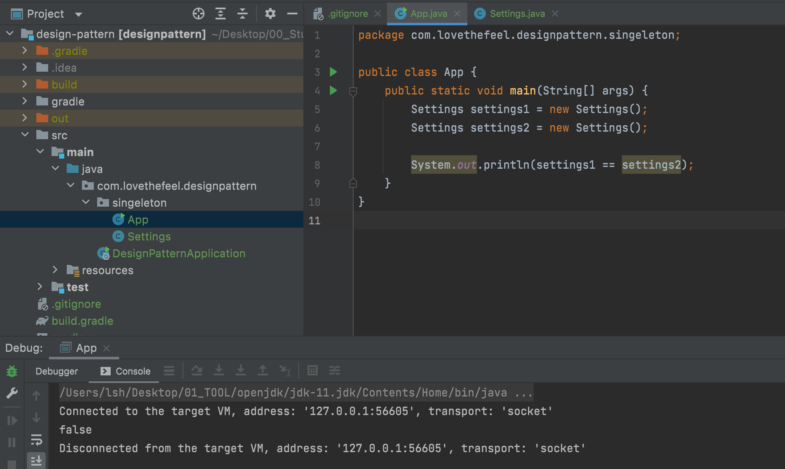

# 싱글톤 패턴
인스턴스를 오직 한개만 제공하는 클래스

- 시스템 런타임, 환경 세팅에 대한 정보 등, 인스턴스가 여러개 일 때 문제가 생길 수 있는 경우가 있습니다. 인스턴스를 오직 한 개만 만들어 제공하는 클래스가 필요합니다.


  - new를 사용해서 새로운 인스턴스를 여러개 만들 수 있습니다.
  - 새로운 인스턴스가 만들어진 것들은 같지 않습니다.
  - 여기서 싱글톤 패턴을 구현한다면 어떻게 해야 할까요?

## 단순 구현

- `Settings`에서 생성자를 `private`메소드를 이용해서 처리하는 것입니다.
  ```Java
  public class Settings {
      private static Settings instance;

      public static Settings getInstance() {
          if (instance == null) {
              instance = new Settings();
          }
          return instance;
      }
  }
  ```
  - static 변수 instance를 하나 선언하여 줍니다.
  - static 메소드를 통해 외부에서 호출할 수 있도록 합니다.
    - instance 변수가 null인 경우 새로 생성하여 리턴합니다.
    - instance 변수가 null이 아닌 경우 생성된 객체를 리턴합니다.

### 심각한 문제

- 웹 애플리케이션을 만들 때 개발하는 환경은 바로 `Multi Thread` 환경입니다.
- `Multi Thread`에서 안전하지 않은 코드입니다.
- `Thread` 2개가 동시에 if 문안으로 들어왔을 때, 각가의 `Thread`가 실행을 하기 때문에 달라지게 됩니다.
- `Thread Safe`하지 않습니다.

## sychronized 이용한 구현

- 하나의 `Thread`만 들어올 수 있도록 처리하는 방법이 있습니다.
  ```Java
  public class SynchronizedSettings {
      private static SynchronizedSettings instance;

      public static synchronized SynchronizedSettings getInstance() {
          if (instance == null) {
              instance = new SynchronizedSettings();
          }
          return instance;
      }
  }
  ```
  - `Thread Safe` 합니다.

### 단점

- 동기화 처리를 위한 비용이 발생하며 성능의 불이익이 생길 수 있습니다.
- 동기화라는 매커니즘이 `Lock`을 잡아서 처리하기 때문입니다.

## 이른 초기화(eager initialization) 이용한 구현

- 미리 만들어 놓는 방법이 있습니다.
  ```Java
  public class EagerInitSettings {
    private static final EagerInitSettings INSTANCE = new EagerInitSettings();

    public static EagerInitSettings getInstance() {
        return INSTANCE;
    }
  }
  ```
  - `Thread Safe` 합니다.
    - 여러 `Thread`가 들어와도 미리 만들어 놓은 것을 사용하기 때문입니다.

### 단점

- 미리 만들어놓는 것이 단점입니다.
  - 만약 미리 만들어놓는 것이 길고 오래 걸리고 메모리를 많이 사용한다면?
  - 또한 자주 사용하지 않는 것이라면?


## double checked locking 이용한 구현

- `getInstance`를 호출할때 마다 `synchronized`가 걸리지 않게 됩니다.
- instance를 필요로 하는 시점에 만들 수 있습니다.
  ```Java
  public class DoubleCheckedLockingSettings {
      private static volatile DoubleCheckedLockingSettings instance;

      private DoubleCheckedLockingSettings() {}

      public static DoubleCheckedLockingSettings getInstance() {
          if (instance == null) {
              synchronized (DoubleCheckedLockingSettings.class) {
                  if (instance == null) {
                      instance = new DoubleCheckedLockingSettings();
                  }
              }
          }
          return instance;
      }
  }
  ```
  - `Thread Safe` 합니다.

  ### 단점

  - 코드가 조금 복잡해집니다.

  ## static inner 클래스 이용한 구현

  - 권장하는 방법입니다.
    ```Java
    public class StaticInnerSettings {
      private StaticInnerSettings() {}

      private static class SettingsHolder {
        private static final StaticInnerSettings INSTANCE = new StaticInnerSettings();
      }

      public static StaticInnerSettings getInstance() {
        return SettingsHolder.INSTANCE;
      }
    }
    ```
    - `Thread Safe` 합니다.
    - getInstance 호출할 때 SettingHolder가 로딩되고 그때 인스턴스를 만들기 때문에 Lazy Loading도 가능합ㅂ니다.
    - double checked locking보다 복잡하지 않고 이론적인 배경 또한 필요 없습니다.


## 실무에서 사용

- 스프링에서 빈의 스코프 중에 하나로 싱글톤 스코프
- 자바 java.lang.Runtime
- 다른 디자인 패턴(빌더, 퍼사드, 추상 팩토리 등) 구현체의 일부로 쓰이기도 합니다.
