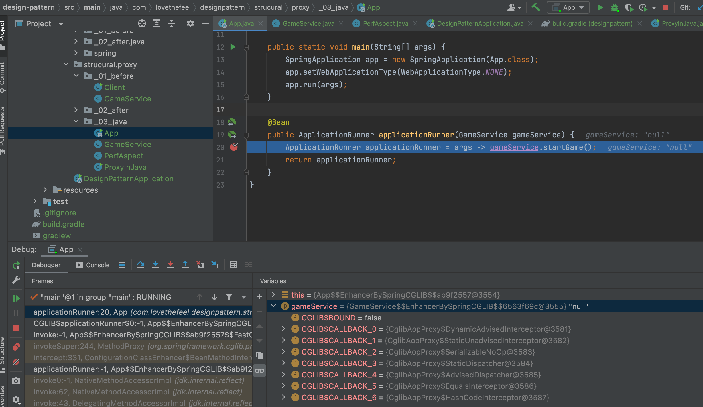

# 프록시 패턴
특정 객체에 대한 접근을 제어하거나 기능을 추가할 수 있는 패턴

- 사전적인 개념
  - 대리, 대리인
  - 클라이언트가 원래 사용하려는 객체를 직접 사용하는 것이 아닌 대리인을 거쳐서 사용하는 것입니다.
- 맨 처음 요청은 무조건 프록시를 통하게 됩니다.
- 장점으로는 다음과 같습니다.
  - 객체의 대한 접근 제어 활용
  - 생성하는데 많은 리소스를 필요한 객체라면 최초로 쓰일 때 만드는, 초기화 지연 방법의 활용
  - 캐싱 활용
  - 로깅 활용

## 장점

- 기존 코드를 변경하지 않고 새로은 기능을 추가할 수 있습니다.
- 기존 코드가 해야 하는 일만 유지할 수 있습니다.
- 기능 추가 및 초기화 지연 등으로 다양하게 활용할 수 있습니다.

## 단점

- 코드의 복잡도가 증가합니다.


## 자바와 스프링

- 자바
  - 다이나믹 프록시, java.lang.reflect.Proxy
  - 예제
    ```java
    private GameService getGameServiceProxy(DefaultGameService target) {
    return (GameService) Proxy.newProxyInstance(this.getClass().getClassLoader(),
            new Class[]{GameService.class}, new InvocationHandler() {
                @Override
                public Object invoke(Object proxy, Method method, Object[] args) throws Throwable {
                    System.out.println("Hello dynamic proxy");
                    // 메소드를 실행하기 위한
                    // target : 어떤 클래스를 실행할것인지
                    // args : 필요한 인자값
                    method.invoke(target, args);
                    return null;
                }
              });
    ```
    - 위 코드가 실행이 될때 Proxy 인스턴스가 실행됩니다.
    - 인자는 클래스로더와 동적으로 생성되는 프록시가 구현해야할 인터페이스 타입, InvocationHandler의 인스턴스를 필요로 합니다.
    - InvocationHandler의 인스턴스의 invoke 메소드는 어떤 인스턴에 있는 메소드를 실행할 것인가와 메소드를 실행할때 인자를 필요로 합니다.
    - 우리가 무언가를 하고 싶다면 method.invoke 앞뒤로 해주면 됩니다.


- 스프링
  - 위에서 자바에서 제공하는 기능들을 스프링에서 AOP로 제공합니다.
  - Aspect Oriented Programing
  - 공통으로 사용되는 기능들에 대해서 AOP를 활용하여 적용
    - ex) 성능 측정 기능
  - 예제
    ```java
    @Aspect
    @Component
    public class PerfAspect {

      @Around("bean(gameService)")
      public void timestamp(ProceedingJoinPoint point) throws Throwable {
        long before = System.currentTimeMillis();
        point.proceed();
        System.out.println(System.currentTimeMillis() - before);
      }
    }
    ```
    - @Component - 스프링이 관리하는 Bean에 대해서만 적용 가능
    - @Aspect -
    - @Aroud - 어디에 적용할지
    - @ProceedingJoinPoint - Aspect가 적용되는 지점, 메소드
    - 호출 순서
      - 스프링이 구동될 때 다이나믹 프록시를 이용해서 빈을 만들 때 게임서비스 타입의 또 다른 프록시를 만들어 놓습니다.
      - 그래서 프록시 빈을 주입 받아서 사용을 하게 됩니다.
        

## 정리

- 프록시 패턴을 이용해서 추상화할 수 있습니다.
- AOP는 다른 영역 기능들의 기반
  - @Transactional
  - @Cacheable
