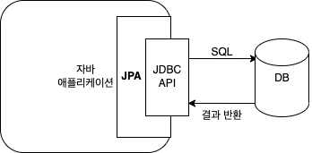
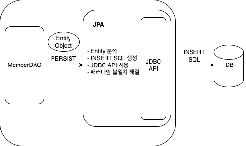
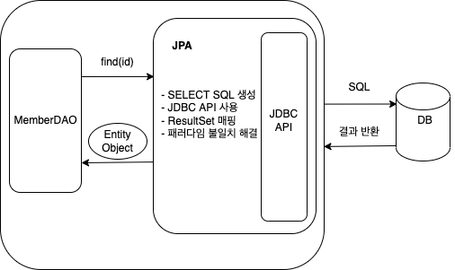

JPA 소개
========

-	지루하고 반복적인 CRUD SQL을 알아서 처리해줄 뿐만 아니라 객체 모델링과 관계형 데이터베이스 사이의 차이점도 해결해줍니다.

-	실행 시점에 자동으로 SQL을 만들어서 실행하는데, JPA를 사용하는 개발자는 SQL 직접 작성하는 것이 아니라 어떤 SQL이 실행될지 생각만 하면 됩니다.

-	귀칞은 문제들은 JPA에 맡기고 더 좋은 객체 모델링과 더 많은 테스트를 작성하는 데 노력을 가하자.

1.1 SQL을 직접 다룰 때 발생하는 문제점
--------------------------------------

-	자바로 개발하는 애플리케이션은 대부분 관계형 데이터베이스를 데이터 저장소로 사용합니다.

-	데이터베이스에 데이터를 관리하려면 SQL을 사용해야 하며, 자바로 작성된 애플리케이션은 JDBC API를 사용해서 SQL를 데이터베이스에 전달합니다.

### 1.1.1 반복, 반복 그리고 반복

-	회원 관리 기능을 개발해봅시다.
	-	회원 테이블을 만들었고 회원을 CRUD(등록, 수정, 삭제, 조회)하는 기능을 개발해봅시다.
	-	조회 기능
		1.	먼저는 회원 객체를 만들어야 하고
		2.	그 다음은 회원용 DAO(데이터 접근 객체)를 만들어야 하고
		3.	DAO의 메소드를 생성한 후
		4.	메소드의 역할에 맞는 SQL 작성
		5.	JDBC API를 사용해서 SQL 실행하고
		6.	그 결과를 회원 객체 매핑시키면 됩니다.
	-	등록 기능
		-	3 ~ 6번의 반복입니다.
-	회원 객체를 데이터베이스가 아닌 자바 컬렉션에 보관한다면 어떨까요? 다음 한줄이면 저장할 수 있습니다.

```java
list.add(member)
```

-	데이터베이스는 객체 구조와는 다른 데이터 중심의 구조를 가지므로, 객체를 데이터베이스에 직접 저장하거나 조회할 수는 없습니다.
-	개발자가 객체지향 애플리케이션과 데이터베이스 중간에서 SQL과 JDBC API를 사용해서 변환 작업을 직접 해줘야 합니다.
-	문제는 위에서 예시를 본것처럼, 너무 많은 SQL과 JDBC API를 작성해야 합니다.

### 1.1.2 SQL에 의존적인 개발

-	앞에서 만든 회원 객체를 관리하는 코드를 완성한 후 회원의 연락처를 추가해달라는 요청이 들어왔습니다.
-	회원 등록 코드 변경
	-	객체의 필드 추가
	-	등록 쿼리 수정
	-	등록 결과 매핑
-	회원 조회 코드 변경
	-	조회 쿼리 수정
	-	조회 결과 매핑
-	회원 정보 수정 코드 변경
	-	수정 쿼리 수정
	-	수정 결과 매핑
-	회원 객체를 데이터베이스가 아닌 자바 컬렉션에 보관한다면 어떨까요?

```java
list.add(member);
Member member = list.get(xxx);
member.setTel("xxx");
```

-	연관된 객체
	-	회원은 한 팀에 필수로 소속되어야 한다는 요구사항이 추가되었습니다.
	-	하지만 팀의 값이 `null`로 들어가고 있었고 데이터 베이스를 확인해보니 팀의 값은 필수였습니다.
	-	소스를 확인해보니 회원 조회 메소드가 2개가 존재하고 있었고 팀을 조회하는 메소드를 사용한 것이 아닌 회워만 조회하는 기존 메소드를 호출하고 있습니다.

#### SQL 의존적인 개발의 문제점

-	엔티티를 신뢰할 수 없고 DAO를 열어서 어떤 SQL이 실행되는지 일일이 확인해야 헙니다.
-	엔티티와 DAO의 CRUD 코드, SQL이 강한 의존관계를 가지고 있어서 객체에 필드 하나만 추가해도 전부 수정을 해야 합니다.

#### 요약

-	진정한 의미의 계층 분할이 어렵다.
-	엔티티를 신뢰할 수 없다.
-	SQL에 의존적인 개발을 피하기 어렵다.

### 1.1.3 JAP와 문제 해결

-	JPA는 위에서 문제들을 어떻게 해결할 수 있을까?
-	회원 등록 기능

```java
  jpa.persist(member);
```

-	`persist()` 메소드는 객체를 데이터베이스에 저장합니다.
-	이 메소드를 호출하면 JPA와 객체와 매핑정보를 보고 적절한 INSERT SQL을 생성해서 데이터베이스에 전달합니다.
-	회원 조회 기능

```java
  String memberId = "hello";
  Member member = jpa.find(Member.class, memberId);
```

-	`find()` 메소드는 객체 하나를 데이터베이스에서 조회합니다.
-	이 객체와 매핑정보를 보고 적절한 SELECT SQL을 생성해서 데이터베이스에 전달하고 그 결과로 Member 객체를 생성해서 반환합니다.
-	회원 수정 기능

```java
  Member member = jpa.find(Member.class, memberId);
  member.setName("이름변경");
```

-	별도의 수정 메소드를 제공하지 않스빈다.
-	대신에 객체를 조회해서 값을 변경만 하면 트랙잭션을 커밋할 때 데이터베이스에 적절한 UPDATE SQL이 전달됩니다.
-	연관된 객체 조회

```java
  Member member = jpa.find(Member.class, memberId);
  Team team = member.getTeam();
```

-	연관된 객체를 사용하는 시점에 적절한 SELECT SQL을 실행합니다.

1.2 패러다임의 불일치
---------------------

-	애플리케이션은 발전하면서 그 내부의 복잡성도 점줌 커지게 되는데, 지속 가능한 애플리케이션을 개발하는 일은 끊임없이 증가하는 복잡성과의 싸움입니다.
-	비즈니스 요구사항을 정의한 도메인 모델로 객체로 모델링하면 객체지향 언어가 가진 장점들을 활용할 수 있습니다.
-	문제는 이렇게 정의한 도메인 모델을 저장할 때 발생하게 됩니다.
-	예를 들어 회원가입하면 회원이라는 객체 인스턴스를 생성한 후 이 객체를 메모리가 아닌 어딘가에 영구 저장을 해야 합니다.
-	현실적인 대안은 관계형 데이터베이스에 저장하는 것이지만 관계형 데이터베이스는 데이터 중심으로 구조화되어 있고 집합적인 사고를 요구합니다.
-	그리고 객체지향에서 이야기하는 추상화, 상속, 다형성 같은 개념이 없습니다.
-	객체와 관계형 데이터베이스는 지향하는 목적이 서로 다르므로 둘의 기능과 표현 방법도 다릅니다.
-	자바와 관계형 데이터베이스 사이에서 개발자가 중간에서 해결해야 하여, 해결하는 데 너무 많은 시간과 코드를 소비하고 있습니다.

### 1.2.1 상속

-	객체는 상속이라는 기능을 가지고 있지만 테이블은 상속이라는 기능이 없다.
-	테이블에서는 슈퍼타입과 서브타입 관계를 사용하면 객체 상속과 유사한 형태로 테이블을 설계할 수 있습니다.
-	객체 모델 코드

```java
  abstract class Item {
    Long id;
    String name;
    int price;
  }

  class Album extends Item {
    String artist;
  }

  class Movie extends Item {
    String director;
    String actor;
  }

  class Book extends Item {
    String author;
    String isbn;
  }
```

-	Album 객체를 저장하려면 이 객체를 분해해서 SQL 2개 만들어야 합니다.

	```SQL
	INSERT INTO ITEM ...
	INSERT INTO ALBUM ...
	```

-	Movie 객체도 마찬가지입니다.

-	JDBC API를 사용해서 작성하려면 부모 객체에서 부모 데이터만, 자식 객체에서 자식 데이터만 꺼내서 각각의 INSERT SQL을 작성해야 합니다.

-	조회하는 것도 쉽지는 않은데, 예를 들어 Album을 조회하려면 ITEM과 ALBUM 테이블을 조인해서 조회한 다음 Album 객체를 생성해야 합니다.

	-	JPA를 알기전까지 정말 많이 진행하였고 당연히 진행하였던 작업이었습니다.

-	자바 컬렉션에서 보관한다면 다음과 같이 간단하게 할 수 있습니다.

```java
  list.add(album);
  list.add(movie);

  Album album = list.get(albumId);
```

#### JPA 상속

-	JPA는 상속과 관련된 패러다임의 불일치 문제를 개발자 대신 해결해줍니다.
-	JPA를 사용해서 Item을 상속한 Album 객체를 저장해봅시다.

	```java
	jpa.persist(album);
	```

-	JPA는 다음 SQL을 실행해서 객체를 ITEM, ALBUM 두 테이블에 나누어 저장합니다.

-	다음으로 Album 객체를 조회해봅니다.

	```java
	String albumId = "id";
	Album album = jpa.find(Album.class, albumId);
	```

-	JPA는 ITEM과 ALBUM 두 테이블을 조인해서 필요한 데이터를 조회하고 그 결과를 반환하게 됩니다.

### 1.2.2 연관관계

-	객체는 참조를 사용해서 다른 객체와 연관관계를 가지고 참조에 접근해서 연관된 객체를 조회합니다.
-	테이블은 외래 키를 사용해서 다른 테이블과 연관관계를 가지고 조인을 사용해서 연관된 테이블을 조회합니다.
-	객체 관점
	-	Member 객체는 Member.team 필드에 Team 객체의 참조를 보관해서 Team 객체와 관계를 맺습니다.
	-	이 참조 필드에 접근하면 Member와 연관된 Team을 조회할 수 있습니다.
-	테이블 관점
	-	MEMBER 테이블은 MEMBER.TEAM_ID 외래 키 컬럼을 사용해서 TEAM 테이블과 관계를 맺습니다.
	-	이 외래 키를 사용해서 MEMBER 테이블과 TEAM 테이블을 조인하면 MEMBER 테이블과 연관된 TEAM 테이블을 조회할 수 있습니다.
-	조금 어려운 문제
	-	객체는 참조가 있는 방향으로만 조회할 수 있습니다.
	-	member.getTeam()은 가능하지만 반대 방향인 team.getMember()는 참조가 없으므로 불가능합니다.
	-	테이블은 외래 키 하나로 MEMBER JOIN TEAM 도 가능하지만 TEAM JOIN MEMBER도 가능합니다.

#### 객체를 테이블에 맞추어 모델링

-	테이블에 맞춘 객체 모델링

```java
  class Member {
    String id;        // MEMBER_ID 컬럼 사용
    Long teamId;      // TEAM_ID FK 컬럼 사용
    String username;  // USERNAME 컬럼 사용
  }

  class Team {
    Long id;          // TEAM_ID PK 사용
    String name;      // NAME 컬럼 사용
  }
```

-	테이블의 컬럼을 그대로 가져와서 Member 클래스를 만들었는데, 이렇게 객체를 테이블에 맞추어 모델링하면 객체를 테이블에 저장하거나 조회할 때는 편리합니다.
-	하지만 TEAM_ID 외래 키의 값을 그대로 보관하는 teamId 필드에는 문제가 있습니다.
-	객체는 연관된 객체의 참조를 보관해야 다음처럼 참조를 통해 연관된 객체를 찾을 수 있습니다.

	```java
	Team team = member.getTeam();
	```

-	관계형 데이터베이스는 조인이라는 기능이 있으므로 외래 키의 값을 그대로 보관해도 됩니다.

#### 객체지향 모델링

-	참조를 사용하는 객체 모델

```java
  class Member {
    String id;
    Team team;        // 참조로 연관관계를 맺는다.
    String username;

    Team getTeam() {
      return team;
    }
  }

  class Team {
    Long id;
    String name;
  }
```

-	Member.team 필드를 보면 외래 키의 값을 그대로 보관하는 것이 아니라 연관된 Team의 참조를 보관하고 있습니다.
-	하지만 객체지향 모델링을 사용하면 객체를 테이블에 저장하거나 조회하기가 쉽지 않습니다.
	-	객체 모델은 외래 키가 필요 없고 단지 참조만 있으면 됩니다.
	-	테이블은 참조가 필요 없고 외래 키만 있으면 됩니다.
	-	결국, 개발자가 중간에서 변환 역할을 해야 합니다.

##### 저장

-	객체를 데이터베이스에 저장하려면 Team 필드를 TEAM_ID 외래 키 값으로 변환을 해야 합니다.
-	외래 키 값을 찾아서 INSERT SQL을 만들어야 하는데 MEMBER 테이블에 저장해야 할 TEAM_ID 외래 키는 TEAM 테이블의 기본 키이므로 member.getTeam().getId()로 구할 수 있습니다.

```java
  member.getId();
  member.getTeam().getId();
  member.getUsername();
```

##### 조회

-	TEAM_ID 외래 키 값을 Member 객체의 team 참조로 변환해서 객체에 보관해야 합니다.
-	개발자가 직접 연관관계 설정

```java
  public Member find(String memberId) {
    // SQL 실행
    ...
    Member member = new Member();
    ...
    // 데이터베이스에서 조회한 회원 관련 정보를 모두 입력
    Team team = new Team();
    ...
    // 데이터베이스에서 조회한 팀 관련 정보를 모두 입력

    // 회원과 팀 관계 설정
    member.setTeam(team);
    return member
  }
```

-	위 과정은 모두 패러다임 불일치를 해결하려고 소모하는 비용입니다.

#### JPA와 연관관계

-	JPA는 연관관계와 관련된 패러다임의 불일치 문제를 해결해줍니다.

```java
  member.setTeam(team);
  jpa.persist(member);
```

-	개발자는 회원과 팀의 관계를 설정하고 회원 객체를 저장만 하면 됩니다.
-	JPA는 team의 참조를 외래 키로 변환해서 적절한 INSERT SQL을 데이터베이스에 전달하게 됩니다.
-	객체를 조회할 때 외래 키를 참조로 변환하는 일도 JPA가 처리해줍니다.

```java
  Member member = jpa.find(Member.class, memberId);
  Team team = member.getTeam();
```

### 1.2.3 객체 그래프 탐색

-	객체에서 회원이 소속된 팀을 조회할 때는 다음처럼 참조를 사용해서 연관된 팀을 찾으면 되는데, 이것을 `객체 그래프 탐색` 이라고 합니다.

	```Java
	Team team = member.getTeam();
	```

-	`MemberDAO`에서 `member`객체를 조회할 때 다음 SQL을 사용하였다고 합니다.

	```SQL
	SELECT M.*, T.*
	FROM MEMBER M
	JOIN TEAM T ON M.TEAM_ID = T.TEAM_ID
	```

	-	`member.getTeam()`은 성공하지만 다음처럼 다른 객체 그래프는 데이터가 없으므로 탐색할 수 없습니다.

		```Java
		member.getOrder(); // null
		```

#### SQL 의존적인 개발의 문제점

-	SQL을 직접 다루면 처음 실행하는 SQL에 따라 객체 그래프를 어디까지 탐색할 수 있는지 정해집니다.

	-	이것은 객체지향 개발자에겐 너무 큰 제약입니다. 왜냐하면 비즈니스 로직에 따라 사용하는 개체 그래프가 다른데 언제 끊어질지 모를 객체 그래프를 함부로 탐색할 수는 없기 때문입니다.

	```Java
	    class MemberService {
	    ...
	    public void process() {
	        Member member = memberDAO.find(memberId);
	        member.getTeam(); // member -> team 객체그래프탐색이 가능한가?
	        member.getOrder().getDelivery(); // ???
	    }
	    }
	```

	-	`MemberService`는 `memberDAO`를 통해서 `member`객체를 조회했지만, 이 객체와 연관된 `Team`, `Order`, `Delivery` 방향으로 객체 그래프를 탐색할 수 있을지 없을지는 이 코드만 보고 판단할 수 없기 때문에 SQL을 직접 열여봐야 합니다.

#### JPA와 객체 그래프 탐색

-	JPA 사용 시 객체 그래프를 마음껏 탐색할 수 있습니다.
	-	연관관계 설정 시
-	JPA는 연관된 객체를 사용하는 시점에 적절한 SELECT SQL을 실행합니다.
-	JPA를 사용하면 연관된 객체를 신뢰하고 마음껏 조회할 수 있습니다.
-	이 기능은 실제 객체를 사용하는 시점까지 데이터베이스 조회를 미룬다고 해서 `지연 로딩`이라 합니다.
-	`지연 로딩` 사용 예시

	```Java
	// 처음 조회 시점에 SELECT MEMBER SQL
	Member member = jpa.find(Member.class, memberId);


	Order order = member.getOrder(); order.getOrderDate(); // Order를 사용하는 시점에 SELECT ORDER SQL
	```

	-	`Member`를 사용할 때마다 `Order`를 함께 사용한다면, 각각 조회하는 것보다 조회 시점에 SQL 조인을 사용해서 함께 조회하는 것이 효과적입니다.

### 1.2.4 비교

-	데이터베이스는 기본 키의 값으로 각 로우를 구분합니다.
-	객체는 `동일성`과 `동등성` 비교라는 두 가지 방법이 있습니다.
	-	동일성의 비교는 `==` 입니다. 객체 인스턴스의 주소 값을 비교합니다.
	-	동등성의 비교는 `equals()` 메소드를 사용해서 객체 내부의 값을 비교합니다.

```Java
class MemberDAO {
	public Member getMember(String memberId) {
		String sql = "SELECT * FROM MEMBER WHERE MEMBER_ID = ?";
		...
		// JDBC API, SQL 실행
		return new Member(...);
	}
}
```

```Java
String memberId = "100";
Member member1 = memberDAO.getMember(memberId);
Member member2 = memberDAO.getMember(memberId);

member1 == member2 // 다르다
```

-	member1과 member2는 같은 데이터베이스 로우에서 조회하였지만 객체 측면에서 볼 때 둘은 다른 인스턴스기 때문에 다릅니다.
-	데이터베이스의 같은 로우를 조회하였지만 객체의 동일성 비교에는 실패하게 됩니다.

```Java
Member1 member1 = list.get(0);
Member2 member2 = list.get(0);

member1 == member2 // 같다
```

#### JPA와 비교

-	같은 트랜잭션일 때 같은 객체가 조회되는 것을 보장합니다.

### 1.2.5 정리

-	객체 모델과 관계형 데이터베이스 모델은 지향하는 패러다임이 다릅니다.
-	문제는 이 패러다임의 차이를 극복하기 위해 개발자가 너무 많은 시간과 코드를 소비해야 합니다.
-	더 어려운 문제는 객체지향 애플리케이션답게 정교한 객체 모델링을 할수록 패러다임의 불일치 문제가 더 커진다는 점입니다. 그리고 이 틈을 메우기 위해 개발자가 소모해야 하는 비용도 점점 커지게 됩니다.

1.3 JPA란 무엇인가?
-------------------

-	자바 진영의 ORM 기술 표준이며, 애플리케이션과 JDBC 사이에서 동작합니다.

	-	ORM이란, 객체와 관계형 데이터베이스를 매핑한다는 뜻입니다.

	

-	JPA 저장

	

-	JPA 조회

	

### 1.3.1 JPA 소개

-	하이버네이트를 기반으로 새로운 자바 ORM 기술 표준이 만들어졌는데 이것이 바로 JPA 입니다.
-	JPA는 자바 ORM 기술에 대한 API 표준 명세입니다.
-	JPA를 사용하려면 JPA를 구현한 ORM 프레임워크를 선택해야 하는데, 현재 JPA 2.1을 구현한 ORM 프레임워크는 하이버네이트, EclipseLink, DataNucleus가 있는데 이 중에 하이버네이트가 가장 대중적입니다.
	-	JPA 버전별 특징
		-	JPA 1.0(JSR 220) 2006년 : 초기 버전입니다. 복합 키와 연관관계 기능이 부족하였습니다.
		-	JPA 2.0(JSR 317) 2009년 : 대부분의 ORM 기능을 포함하고 JPA Criteria가 추가되었습니다.
		-	JPA 2.1(JSR 338) 2013년 : 스토어드 프로시저 접근, 컨버터, 엔티티 그래프 기능이 추가되었습니다.

### 1.3.2 왜 JPA를 사용해야 하는가?

-	생산성

	-	지루하고 반복적인 코드와 CRUD용 SQL을 개발자가 직접 작성하지 않아도 됩니다.
	-	DDL 문을 자동으로 생성해주는 기능도 있습니다.

-	유지보수

	-	필드를 추가하거나 삭제해도 수정해야 할 코드가 줄어듭니다.
	-	객체지향 언어가 가진 장점을 활용해서 유연하고 유지보수하기 좋은 도메인 모델을 편리하게 설계할 수 있습니다.

-	패러다임의 불일치 해결

	-	JPA는 상속, 연관관계, 객체 그래프 탐색, 비교하기와 같은 패러다임의 불일치 문제를 해결해줍니다.

-	성능

	-	애플리케이션과 데이터베이스 사이에 계층이 하나 더 있으면 최적화 관점에서 시도해 볼 수 있는 것들이 많습니다.
	-	하이버네이트는 SQL 힌트를 넣을 수 있는 기능도 제공합니다.

-	데이터 접근 추상화와 벤더 독립성

	-	JPA를 사용하면 로컬 개발 환경은 H2 데이터베이스, 개발이나 상용 환경은 오라클이나 MySql 데이터베이스를 사용할 수 있습니다.

-	표준

	-	JPA는 자바 진영의 ORM 기술 표준입니다. 표준을 사용하면 다른 구현 기술로 손쉽게 변경할 수 있습니다.
