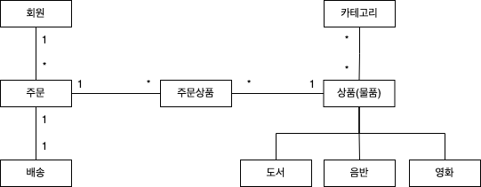
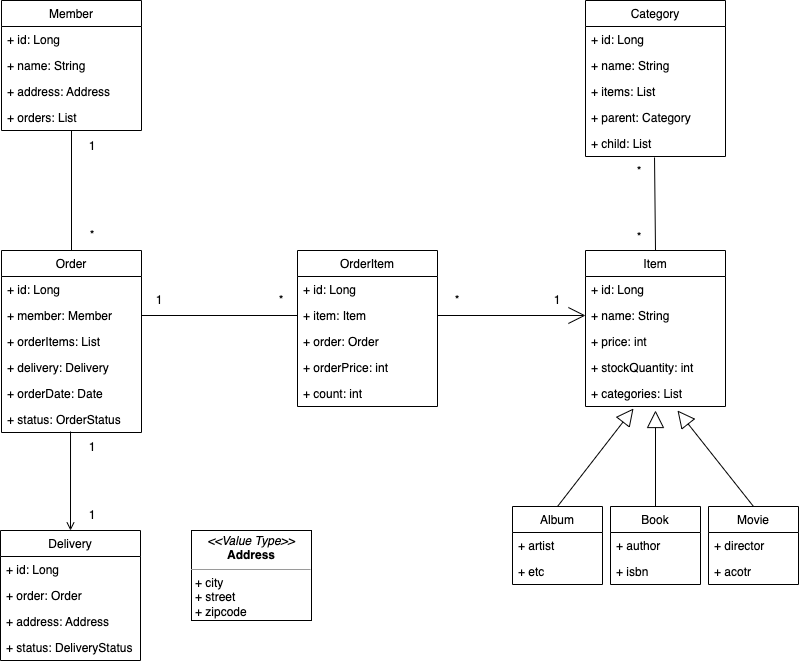
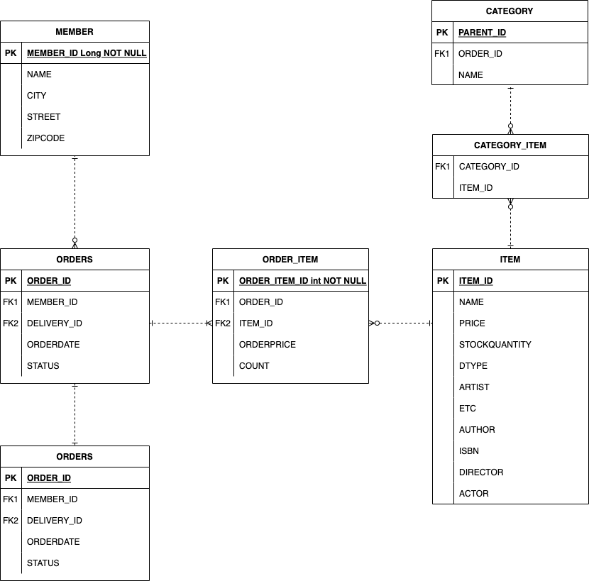

# 도메인 모델과 테이블 설계

- 회원, 주문, 상품의 관계 : 회원은 여러 상품을 주문할 수 있다. 그리고 한 번 주문할 때 여러 상품을 선택할 수 있으므로 주문과 상품은 다대다 관계다. 하지만 이런 다대다 관계는 관계형 데이터베이스는 물론이고 엔티티에서도 거의 사용하지 않는다. 따라서 그림처럼 주문상품이라는 엔티티를 추가해서 다대다 관계를 일대다, 다대일 관계로 풀어냈다.
- 상품 분류 : 상품은 도서, 음반, 영화로 구분되는데 상품이라는 공통 속성을 사용하므로 상속 구조로 표현했다.

- 회원(Member)
  - 이름과 임베디드 타입인 주소(`Address`), 그리고 주문(orders) 리스트를 가진다.

- 주문(Order)
  - 한 번 주문시 여러 상품을 주문할 수 있으므로 주문과 주문상품(OrderItem)은 일대다 관계디
  - 주문은 상품을 주문한 회원과 배송 정보, 주문 날짜, 주문 상태(status)를 가지고 있다.
  - 주문 상태는 열거형을 사용하였는데, 주문(ORDER), 취소(CANCEL)를 표현할 수 있다.

- 주문 상품(OrderItem)
  - 주문한 상품 정보와 주문 금액(orderPrice), 주문 수량(count) 정보를 가지고 있다.(보통 `OrderLine`, `LineItem`으로 많이 표현한다.)

- 상품(Item)
  - 이름, 가격, 재고수량(`stockQuantity`)을 가지고 있다.
  - 상품을 주문하면 재고수량이 줄어든다.
  - 상품의 종류로는 도서, 음반, 영화가 있는데 각각은 사용하는 속성이 조금씩 다르다.

- 배송(Delivery)
  - 주문시 하나의 배송 정보를 생성한다.
  - 주문과 배송은 일대일 관계다.

- 카테고리(Category)
  - 상품과 다대다 관계를 맺는다.
  - `parent`, `child`로 부모, 자식 카테고리를 연결한다.

- 주소(Address)
  - 값 타입(임베디드 타입)이다.
  - 회원과 배송에서 사용한다.

## 강조

- 다대다 관계는 사용하면 안된다.
  - 일대다, 다대일 관계로 풀어내야 한다.
- 가급적이면 양방향 연관관계는 사용하지 말고 단방향 연관관계를 사용해야 한다.
  - 회원과 주문의 관계
  - 회원이 주문을 하니 회원의 주문 목록을 가지고 있으면 되겠다?
  - 회원을 통해서 주문이 생성되는 것이 아니라 주문을 생성할 때 회원이 필요하다라고 생각하는 것이 맞다.
  - 쿼리로 볼때, 주문에서 필터링으로 회원 정보가 들어간다.
